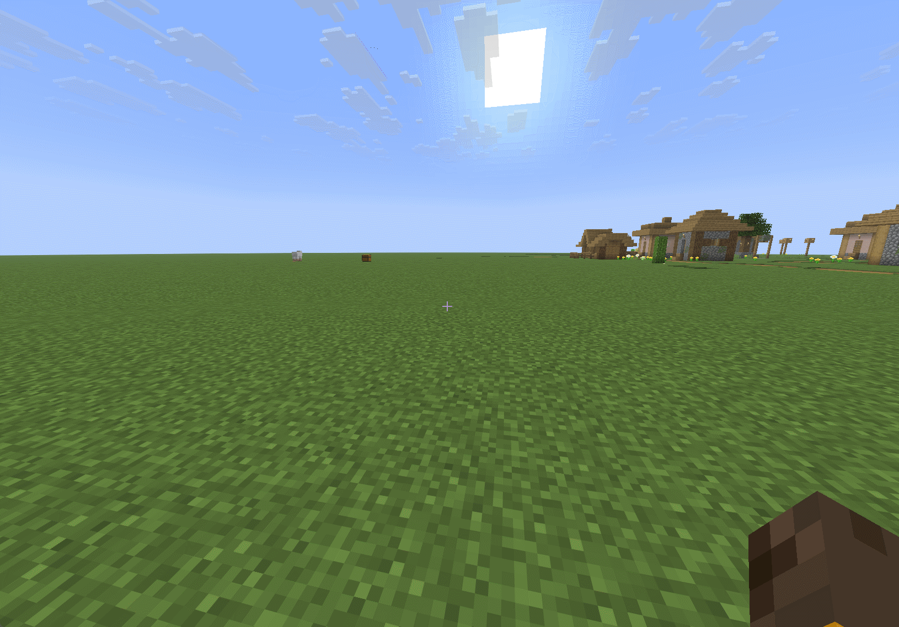

# PVPUtils

  <a href="./README.zh-CN.md"><strong>简体中文</strong></a>

## Obfuscation Notice

Starting from PVPUtils-v1.6-beta.1, PVPUtils introduces a built-in IRC system. To protect its core implementation, the project uses [PAHP](./docs/PAHP.md) for protection, and the related IRC code is not publicly released. The GitHub repository still keeps all non-IRC functionality available; third-party platforms receive no-IRC builds. Users who need IRC access can obtain the IRC build from the official QQ group.

## Introduction

PVPUtils is a client-side utility mod for Minecraft 1.21.11 Fabric. It brings practical survival and PVP tools to the vanilla game, together with a wide range of polished visual components. All interfaces and visual elements are powered by Skija, balancing refined visuals with smooth performance. The mod also supports automatic update checks, so you do not need to manually visit mod platforms to see whether a new version is available. You can also run a command to check for updates manually.

## Features

PVPUtils includes many useful features for PVP and survival gameplay. Because the feature set is broad, the mod groups them into several categories: Combat, Render, Tool, Optimize, Misc, and Theme. These features include polished HUD components, sword blocking animation, dynamic motion blur, input method conflict fixes, block count display, target information display, and more. Download the mod to experience the full feature set.

## Preview

### Settings UI

### HUD Editor

### Sword Blocking Animation

### Gameplay Utilities

## Purpose

PVPUtils was created to fill the gap left by the lack of dedicated PVP experience optimization mods for newer Minecraft versions. Existing similar mods or clients are often not open enough to be freely customized around user needs. Feature-focused mods do exist, but many of them are single-purpose and often lack compatibility with each other.

PVPUtils changes this by being a source-available client-side mod. You may view, study, and modify it under the terms of the project's non-commercial source-available license. It integrates many common PVP and survival assistance and optimization features, allowing one mod to provide an experience that would otherwise require multiple separate mods. As a client-side mod, it can also be combined with other mods to build your own gameplay setup, and PVPUtils continues to adapt to and improve compatibility with mainstream mods.

## Compatibility

The mod currently supports Minecraft 1.21.11 Fabric only. It supports Windows 10 and later, and does not currently support mobile platforms or Bud Island. Thanks to the open-source nature of the project, community versions have already implemented support for related platforms.

Backports to Minecraft 1.20.4 or 1.20.6 Fabric are planned. There are currently no plans to port to higher Minecraft versions, because newer versions temporarily lack a strong PVP-oriented mod ecosystem.

Note: this mod is not compatible with most cheat mods, and using it together with cheat mods is not recommended. If cheat mods cause client crashes or related issues, the management team will not handle those reports. Maintaining a fair game environment is everyone's responsibility.

## Notes

The mod includes several performance optimizations and low-level improvements, which may cause compatibility issues with some render optimization mods. Choose the related features according to your setup. PVPUtils also fixes several Minecraft client bugs, so you can receive those improvements without installing additional mods.

## Disclaimer

This is a client-side mod. It does not provide server-side data modification or cheating features. Every feature is added after considering compatibility, benefits, and tradeoffs. However, some features may still be considered disallowed by certain servers. Before using the mod, carefully read the rules of the server you play on and confirm that you accept all risks yourself. By using this mod, you are considered to have read and understood the relevant server rules and to accept full responsibility. PVPUtils is not responsible for account bans or other consequences caused by server rule violations.

## FAQ

1. Starting from version 1.1, the mod requires Windows 10 or later and the Visual C++ Redistributable runtime. Mobile devices and systems older than Windows 10 are not supported. Use versions earlier than 1.1 if needed.
2. The settings UI and HUD depend on GPU rendering. Smooth performance is not guaranteed on low-end devices, and future versions will continue to optimize performance.
3. The default keybind is `Right Shift`. There is also a settings button in the top-right corner of the inventory screen.
4. Press `P` on the title screen to switch to the custom main UI. Click the title in the top-left corner to return to the vanilla UI, and right-click it to switch UI styles. Low-end devices may stutter during switching; this is normal.
5. Language switching is located under `Misc -> Language Switch`. Right-click to expand it and switch between Chinese and English. Reopen the UI for the change to take effect.
6. This mod is currently not compatible with Lunar Client. Other third-party clients haven't been fully tested yet and might have issues.
7. Target health display may occasionally be inaccurate. This is usually caused by server plugin restrictions and cannot be fixed by the mod.

## License

This project uses the PVPUtils Source-Available Non-Commercial License. Commercial use is not permitted. Derivative works must remain source-available, must credit Nachoneko_miao and PVPUtils contributors, and must clearly document which parts of PVPUtils were used or modified. See [LICENSE](./LICENSE) for the full text.
