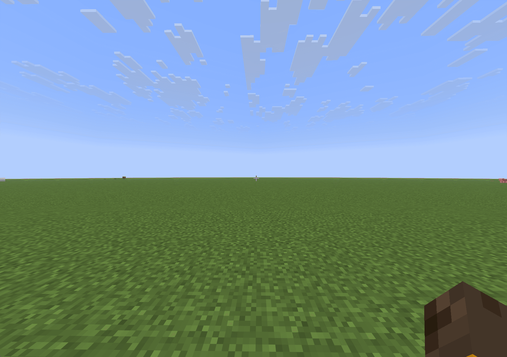
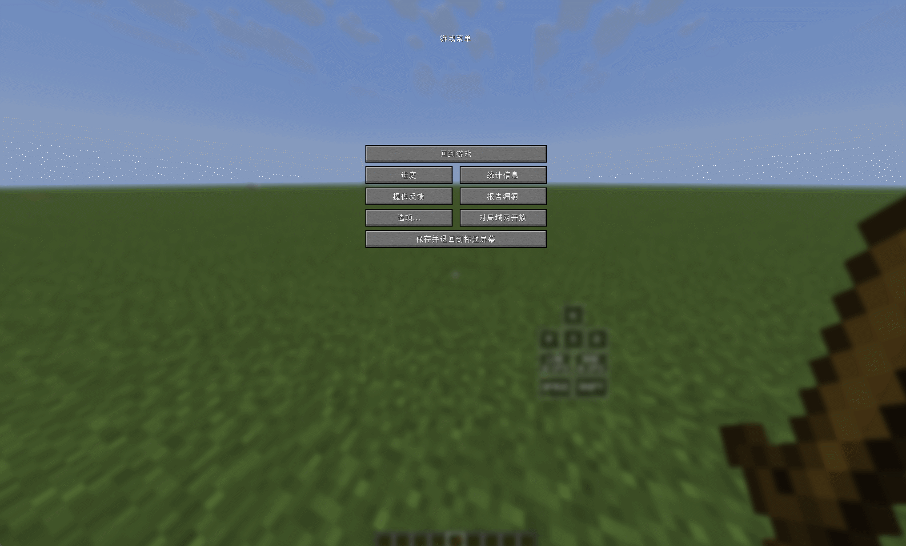

# PVPUtils

## 简介

PVPUtils 是一款面向 Minecraft 1.21.11 Fabric 的客户端辅助模组，为原版游戏带来了实用的生存与 PVP 小工具，以及大量美观的视觉组件。所有界面与视觉元素均由 Skija 强力驱动，兼顾精致观感与流畅性能。同时本模组支持自动更新，您无需手动前往模组平台查看是否有更新，当然您也可以使用指令手动检查更新。

## 特点

PVPUtils 内置了大量对于 PVP 和生存来说十分实用的功能。由于功能较多，本模组将其分为几个大块：战斗、视觉、工具、优化、其他。这些功能包括优美的 HUD 组件、防砍动画、动态模糊、输入法冲突修复、方块数量显示、目标信息显示等丰富内容，具体功能请下载模组自行体验。

## 功能预览

### 设置界面

### HUD 编辑器

### 防砍动画

### 实用功能

## 初衷

PVPUtils 的出现，是为了弥补高版本 Minecraft 缺乏专门针对 PVP 体验进行优化的模组这一空白。现有的同类模组或客户端往往不够开放，无法根据用户需求自由定制；而功能相关的模组虽然不少，但大多功能单一且彼此间缺乏兼容性。

PVPUtils 改变了这一现状。它是一个源码开放的客户端模组，您可以在遵守本项目非商业源码开放许可证的前提下查看、学习和修改。它整合了大部分 PVP 与生存中常见的辅助与优化功能，让您只需安装一款模组，即可获得多款模组带来的完整体验。同时，作为客户端模组，您也可以自由搭配其他模组来定制属于自己的游戏体验，PVPUtils 也在持续适配和兼容大多数主流模组。

## 兼容性

模组目前仅兼容 Minecraft 1.21.11 Fabric，支持 Windows 10 及以上平台，暂不支持手机与布吉岛。不过得益于模组源码开放的性质，已有社区版实现了对相关平台的支持。

未来计划向下移植至 Minecraft 1.20.4 或 1.20.6 Fabric，但对于更高版本暂无移植计划，因为高版本暂时缺乏 PVP 相关的模组生态。

注：本模组不兼容大多数外挂，本模组不提倡与外挂模组一同使用。若因使用外挂模组导致客户端闪退等问题，管理团队将不予受理。维护绿色游戏环境，人人有责。

## 需要注意

模组内置了多项性能优化与底层改进，可能会与部分渲染优化类模组产生兼容性问题，建议您根据实际情况选择性使用。此外，PVPUtils 还修复了 Minecraft 本体中的若干 BUG，您无需安装其他模组即可获得这些增强。

## 说明

本模组为客户端模组，不提供任何服务端数据修改与作弊功能，所有功能均经过兼容性与利弊权衡后加入。但部分功能仍可能被部分服务器视为违规，使用前请务必仔细阅读对应服务器的规则，并确认您同意自行承担一切风险。一旦使用本模组，即视为您已阅读并理解相关服务器规则，且愿自行承担全部责任。若因此导致账号封禁等后果，本模组概不负责。

## 常见问题

1. 模组从 1.1 版本起需要 Windows 10 及以上系统，并安装 Visual C++ Redistributable 运行库。手机及 Windows 10 以下系统暂不支持，如有需要可尝试 1.1 以下的旧版本。
2. 设置界面与 HUD 依赖 GPU 渲染，低配置设备不保证流畅运行，后续版本会持续进行性能优化。
3. 默认快捷键为 `Right Shift`，背包右上角也设有打开设置界面的按钮。
4. 在主界面按 `P` 键可切换自定义界面，点击左上角标题可返回原版界面，右键可切换界面风格。低配置设备切换时可能出现卡顿，属正常现象。
5. 语言切换位于 `Misc` 分页的 `Language Switch` 选项，右键展开后可切换中英文，切换后需重新打开界面方可生效。
6. 模组兼容 Lunar 客户端，其他第三方客户端未做充分测试，使用中可能存在问题。
7. 目标血量显示偶发异常，通常为服务端插件限制所致，属于服务器层面的问题，模组无法修复。

## License

本项目使用 PVPUtils Source-Available Non-Commercial License。禁止商业使用；衍生作品必须保持源码可访问，必须署名 Nachoneko_miao 与 PVPUtils contributors，并且必须清楚说明使用或修改了 PVPUtils 的哪些部分。完整内容以 [LICENSE](./LICENSE) 为准。
